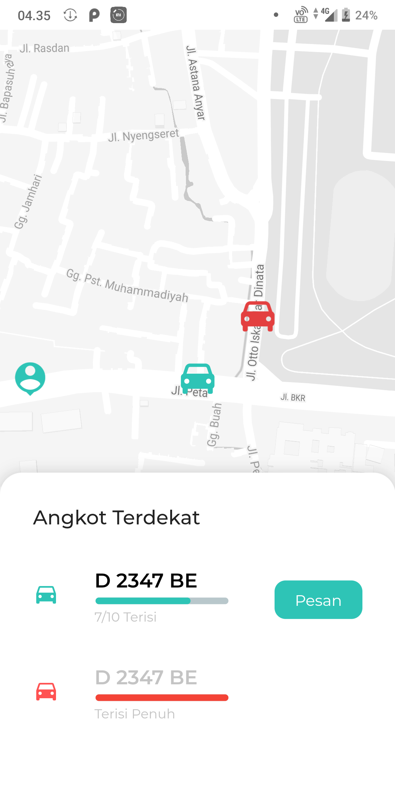
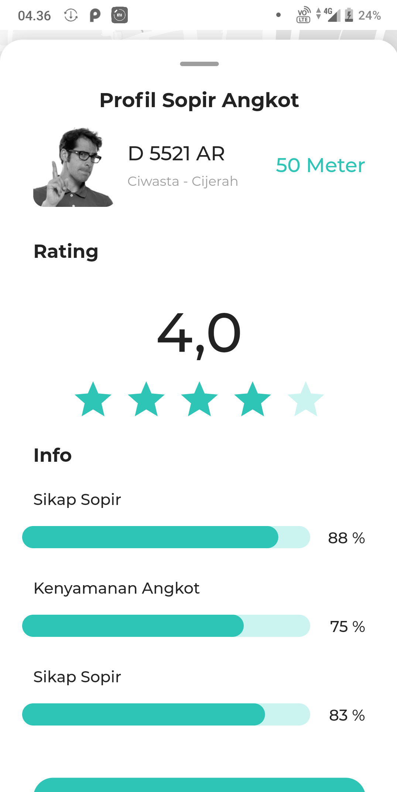
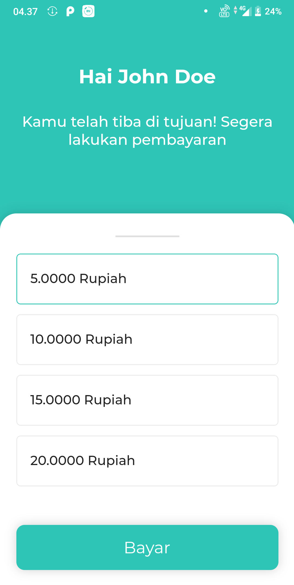
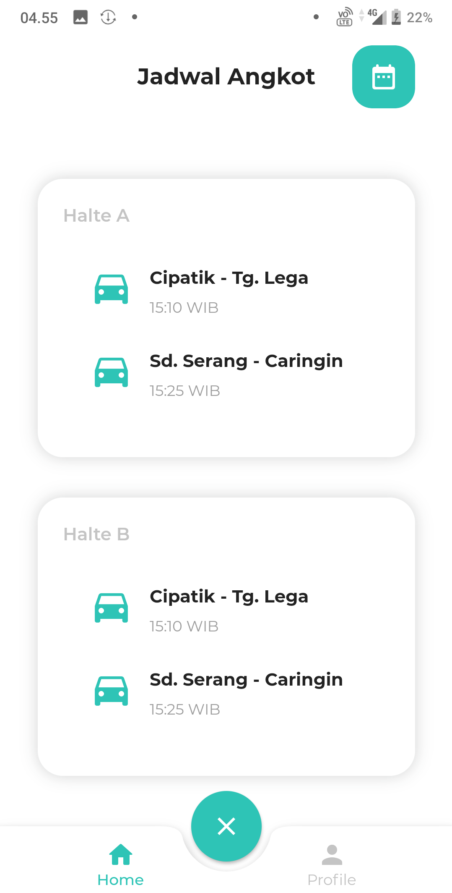
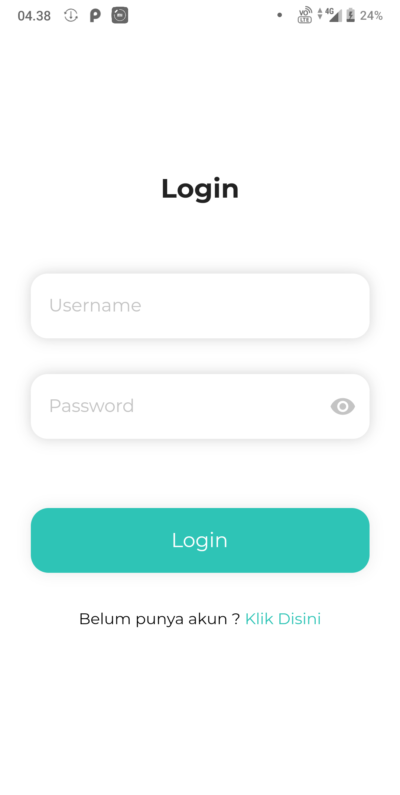
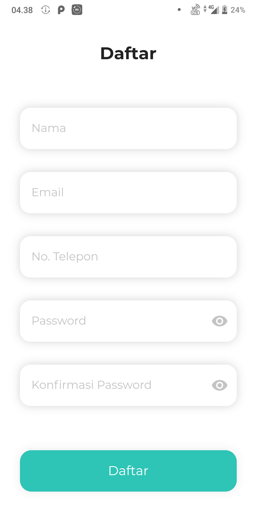

# Angkut (Prototype)

Aplikasi Untuk Tracking Angkot

## Screenshot

  
  
  
 

## Installation

- Add [Flutter](https://flutter.dev/docs/get-started/install) to your machine

- Open this project folder with Terminal/CMD and run `flutter packages get`

- Run `flutter run` to build and run the debug app on your emulator/phone

